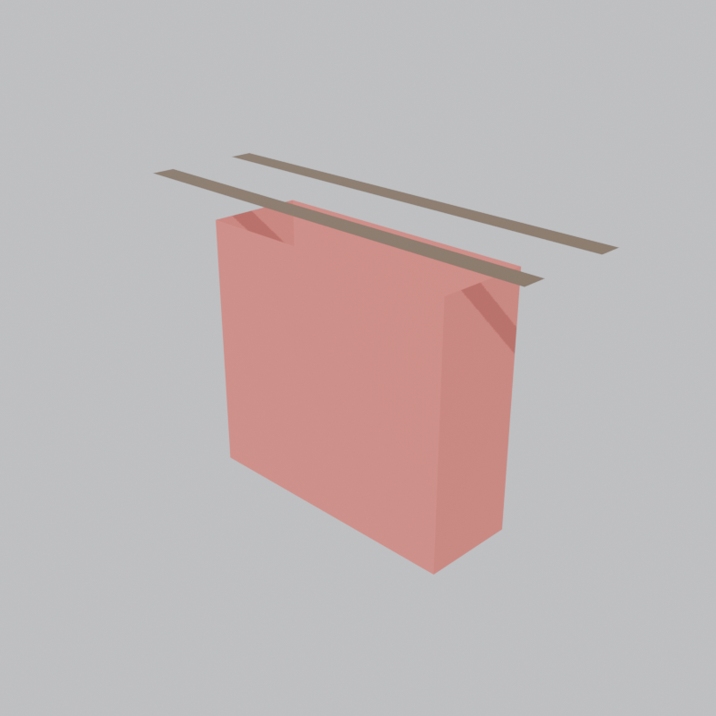
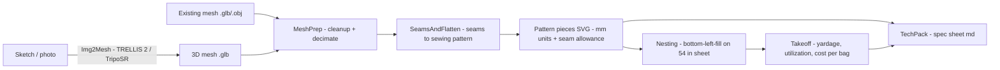

# 3D-Fabric

Design-to-pattern-to-takeoff pipeline for a small-batch handbag line.
Sketch or photo in → 3D model → flattened sewing pattern (SVG) → nested cut layout →
material takeoff (yardage + cost) → tech pack.

> **Status board:** [STATUS.md](STATUS.md) — GREEN/AMBER/RED per component, updated every task.





## One command

```bash
# from an existing mesh (no AI needed)
.venv/Scripts/python run_pipeline.py --mesh "designs/FeltCheckTote.glb" --name FeltCheckTote --width 54 --material canvas

# from a photo or sketch (TripoSR image-to-3D, ~30 s on an RTX 4080)
.venv/Scripts/python run_pipeline.py --image "designs/my-sketch.jpg" --name HoboV1 --material canvas
```

Outputs land in `patterns/<name>/` (labeled pattern SVG + pieces.json),
`takeoffs/<name>/` (nested layout SVG + yardage/cost JSON + CSV), and
`techpack/<name>.md`. Every stage is also a standalone CLI in `pipeline/` — run any
of them with `--help`.

**Demo result (FeltCheck Tote):** 7 pieces, 15.54 in of a 54 in roll, 83.8% utilization,
0.47 yd → **$8.55/unit** at draft canvas pricing — computed in 5.8 s from mesh to tech pack.

All generated patterns and takeoffs are stamped `DRAFT — unverified` until a human
approves them. **AI drafts, engineers seal.**

## Setup (Windows)

1. Blender 4.5 LTS or newer (`winget install BlenderFoundation.Blender.LTS.4.5`)
2. `python -m venv .venv && .venv/Scripts/pip install shapely svgpathtools svgwrite pyyaml pytest pillow trimesh numpy`
3. Add-ons (headless): `blender --background --python scripts/install_addons.py`
4. AI leg (optional): `weights/` via `huggingface_hub` (TripoSR / TRELLIS.2 / Hunyuan3D — all ungated),
   `.venv-ai` with CUDA torch + `transformers==4.40.2`, `pymcubes` shim for torchmcubes (see STATUS notes).
5. `pytest tests/ -q` — Blender-dependent tests skip cleanly when Blender is absent.

## Layout

| Path | What |
|------|------|
| `pipeline/` | Python modules (the product) — common.py holds the data contracts |
| `designs/` | input sketches/photos/meshes |
| `patterns/` | output SVG pattern pieces |
| `takeoffs/` | nested layouts + yardage/cost |
| `techpack/` | generated spec sheets |
| `scripts/` | Blender headless + setup scripts |
| `tests/` | pytest suite (60 tests) |

## Conventions

- Pattern SVGs: 1 user unit = 1 mm. Cut line solid, stitch line dashed red,
  10 mm seam allowance by default (`--allowance-mm`).
- Status: GREEN (works, verified) / AMBER (works, caveats) / RED (blocked + why + log).
- Yard goods priced per linear yard at configurable roll width; leather per hide
  (approximation, flagged in output). Prices in `materials.yaml` are drafts.
