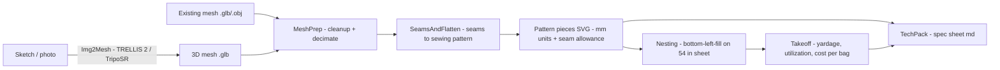

# 3D-Fabric

Design-to-pattern-to-takeoff pipeline for a small-batch handbag line.
Sketch or photo in → 3D model → flattened sewing pattern (SVG) → nested cut layout →
material takeoff (yardage + cost) → tech pack.

> **Status:** bootstrapping — see [STATUS.md](STATUS.md) for the live GREEN/AMBER/RED board.



## Quickstart (once bootstrap completes)

```bash
python run_pipeline.py --mesh "designs/FeltCheckTote.glb" --name FeltCheckTote --width 54 --material canvas
```

Outputs land in `patterns/<name>/`, `takeoffs/<name>/`, and `techpack/<name>.md`.

All generated patterns and takeoffs are stamped `DRAFT — unverified` until a human
approves them. AI drafts, engineers seal.

## Layout

| Path | What |
|------|------|
| `pipeline/` | Python modules (the product) |
| `designs/` | input sketches/photos/meshes |
| `patterns/` | output SVG pattern pieces |
| `takeoffs/` | nested layouts + yardage/cost |
| `techpack/` | generated spec sheets |
| `scripts/` | Blender headless + setup scripts |
| `tests/` | pytest smoke tests |
